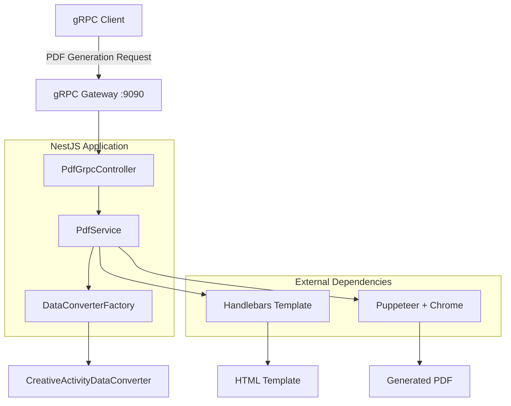
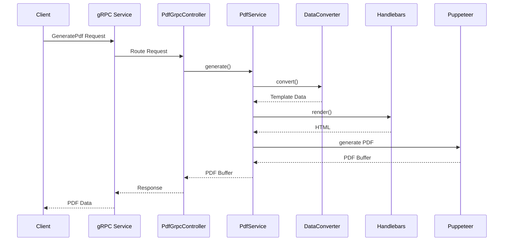

# S-Class PDF Converter

학생부 분석 보고서를 PDF로 변환하는 gRPC 마이크로서비스입니다. 창의적 체험활동, 세부능력특기사항, 탐구 과정 마인드맵, 종합 분석을 지원합니다.

## 🏗️ 아키텍처 개요



## 📋 주요 구성 요소

### 1. gRPC 서비스 레이어

- **Proto 정의**: `src/proto/pdf-generation.proto`
- **패키지**: `pdf.generation`
- **서비스**: `PdfGenerationService`
- **메서드**: `GeneratePdf`

### 2. 컨트롤러 레이어

- **파일**: `src/pdf/pdf-grpc.controller.ts`
- **역할**: gRPC 요청 처리 및 응답 반환
- **데코레이터**: `@PdfGenerationServiceControllerMethods()`

### 3. 서비스 레이어

- **파일**: `src/pdf/pdf.service.ts`
- **역할**: PDF 생성 로직 처리
- **기능**:
  - 데이터 변환
  - 템플릿 렌더링
  - PDF 생성 (Puppeteer)

### 4. 데이터 변환 레이어

- **팩토리**: `src/pdf/converter/data-converter.factory.ts`
- **컨버터들**:
  - `creative-activity-data.converter.ts` - 창의적 체험활동 분석
  - `detailed-abilities.data.converter.ts` - 세부능력특기사항 분석
  - `mindmap-data.converter.ts` - 탐구 과정 마인드맵 분석
  - `overall-analysis-data.converter.ts` - 종합 분석
- **역할**: Java DTO (camelCase) → Handlebars 템플릿 데이터 (snake_case) 변환

### 5. 템플릿 레이어

- **템플릿 파일들**:
  - `create-activity-analysis.hbs` - 창의적 체험활동
  - `detailed-abilities-analysis.hbs` - 세부능력특기사항
  - `mindmap-analysis.hbs` - 탐구 과정 마인드맵 (SVG 그래프 포함)
  - `overall-analysis.hbs` - 종합 분석
- **엔진**: Handlebars
- **Helper Functions**: `toJSON`, `eq`
- **스타일**: CSS (Noto Sans KR 폰트)

## 🔧 기술 스택

### Backend

- **Framework**: NestJS
- **Language**: TypeScript
- **gRPC**: @grpc/grpc-js, @grpc/proto-loader
- **PDF Generation**: Puppeteer + Chrome
- **Template Engine**: Handlebars

### Dependencies

```json
{
  "@nestjs/microservices": "^11.1.7",
  "@grpc/grpc-js": "^1.14.0",
  "@grpc/proto-loader": "^0.7.10",
  "puppeteer": "^24.26.1",
  "handlebars": "^4.7.8"
}
```

## 📊 데이터 플로우



## 🚀 실행 방법

### 개발 환경

```bash
# 의존성 설치
pnpm install

# Chrome 브라우저 설치 (Puppeteer용)
npx puppeteer browsers install chrome

# 개발 서버 실행
pnpm run start:dev
```

### 프로덕션 환경

```bash
# 빌드
pnpm run build

# 프로덕션 실행
node dist/main.js
```

## 📡 gRPC API

### 서비스 정의

```protobuf
service PdfGenerationService {
  rpc GeneratePdf(PdfGenerationRequest) returns (PdfGenerationResponse);
}
```

### 요청 메시지

```protobuf
message PdfGenerationRequest {
  string session_id = 1;
  string analysis_type = 2;         # "creative_activity", "detailed_abilities", "mindmap", "overall_analysis"
  string template_name = 3;          # "create-activity-analysis", "detailed-abilities-analysis", "mindmap-analysis", "overall-analysis"
  string analysis_data = 4;          # JSON string
  PdfOptions options = 5;
}
```

### 지원하는 분석 타입

- **creative_activity** (창의적 체험활동)
  - 템플릿: `create-activity-analysis`
  - 자율활동, 동아리활동, 진로활동, 봉사활동 분석

- **detailed_abilities** (세부능력특기사항)
  - 템플릿: `detailed-abilities-analysis`
  - 과목별 능력 분석 및 종합 평가

- **mindmap** (탐구 과정 마인드맵)
  - 템플릿: `mindmap-analysis`
  - 중앙 주제와 메인/서브 브랜치 그래프 시각화

- **overall_analysis** (종합 분석)
  - 템플릿: `overall-analysis`
  - 학생 프로필, 핵심 역량, 성장 영역 분석

### 응답 메시지

```protobuf
message PdfGenerationResponse {
  bool success = 1;
  string message = 2;
  bytes pdf_data = 3;
  string file_name = 4;
}
```

## 📁 프로젝트 구조

```
src/
├── proto/
│   └── pdf-generation.proto              # gRPC 서비스 정의
├── pdf/
│   ├── pdf-grpc.controller.ts           # gRPC 컨트롤러
│   ├── pdf.service.ts                   # PDF 생성 서비스
│   ├── pdf.module.ts                    # PDF 모듈
│   └── converter/
│       ├── data-converter.factory.ts    # 컨버터 팩토리
│       ├── creative-activity-data.converter.ts
│       ├── detailed-abilities.data.converter.ts
│       ├── mindmap-data.converter.ts
│       ├── overall-analysis-data.converter.ts
│       └── types/
│           ├── index.ts                 # 타입 export
│           ├── common.types.ts         # 공통 타입
│           ├── creative-activity.types.ts
│           ├── detailed-abilities.types.ts
│           ├── mindmap.types.ts
│           └── overall.types.ts
├── templates/
│   ├── create-activity-analysis.hbs    # 창의적 체험활동
│   ├── detailed-abilities-analysis.hbs  # 세부능력특기사항
│   ├── mindmap-analysis.hbs            # 탐구 과정 마인드맵
│   └── overall-analysis.hbs            # 종합 분석
├── config/
│   ├── configuration.ts                 # 설정 관리
│   └── configuration.module.ts
├── app.module.ts                        # 애플리케이션 모듈
└── main.ts                              # 애플리케이션 진입점
```

## 🔧 설정

### 환경 변수

- `PORT`: HTTP 서버 포트 (기본값: 3000)
- `GRPC_PORT`: gRPC 서버 포트 (기본값: 9090)

### 템플릿 경로

- **개발**: `src/templates/`
- **프로덕션**: `process.cwd()/src/templates/`

## 📝 사용 예시

### gRPC 클라이언트 예시

```javascript
const grpc = require('@grpc/grpc-js');
const protoLoader = require('@grpc/proto-loader');

// Proto 파일 로드
const packageDefinition = protoLoader.loadSync(
  'src/proto/pdf-generation.proto',
);
const pdfGenerationProto =
  grpc.loadPackageDefinition(packageDefinition).pdf.generation;

// 클라이언트 생성
const client = new pdfGenerationProto.PdfGenerationService(
  'localhost:9090',
  grpc.credentials.createInsecure(),
);

// PDF 생성 요청 (창의적 체험활동 분석)
const request = {
  session_id: 'test-session-123',
  analysis_type: 'creative_activity',
  template_name: 'create-activity-analysis',
  analysis_data: JSON.stringify({
    autonomousActivity: {
      summary: '자율활동 요약',
      analysis: '자율활동 분석',
      evaluation: '자율활동 평가',
    },
    clubActivity: {
      /* ... */
    },
    careerActivity: {
      /* ... */
    },
    volunteerActivity: {
      /* ... */
    },
    comprehensiveConclusion: {
      /* ... */
    },
    crossValidation: {
      /* ... */
    },
  }),
  options: {
    format: 'A4',
  },
};

client.GeneratePdf(request, (error, response) => {
  if (error) {
    console.error('Error:', error);
    return;
  }

  console.log('PDF 생성 성공:', response.success);
  console.log('파일명:', response.file_name);
  console.log('파일 크기:', response.pdf_data.length, 'bytes');
});
```

### 다른 분석 타입 요청 예시

#### 세부능력특기사항 분석

```javascript
const request = {
  session_id: 'test-session-124',
  analysis_type: 'detailed_abilities',
  template_name: 'detailed-abilities-analysis',
  analysis_data: JSON.stringify({
    subjectAnalyses: [
      {
        subjectName: '국어',
        summary: '과목 요약',
        analysis: '과목 분석',
        evaluation: '과목 평가',
        keyPoints: ['핵심 내용 1', '핵심 내용 2'],
      },
    ],
    comprehensiveConclusion: {
      /* ... */
    },
  }),
  options: { format: 'A4' },
};
```

#### 탐구 과정 마인드맵

```javascript
const request = {
  session_id: 'test-session-125',
  analysis_type: 'mindmap',
  template_name: 'mindmap-analysis',
  analysis_data: JSON.stringify({
    centralTheme: { theme: '중앙 주제', color: '#667eea' },
    mainBranches: [{ name: '주요 항목', color: '#ff6b6b', priority: 1 }],
    subBranches: [
      /* ... */
    ],
    connections: [
      /* ... */
    ],
  }),
  options: { format: 'A4' },
};
```

#### 종합 분석

```javascript
const request = {
  session_id: 'test-session-126',
  analysis_type: 'overall_analysis',
  template_name: 'overall-analysis',
  analysis_data: JSON.stringify({
    studentProfile: {
      personalityType: '탐구형',
      learningStyle: '주도적 학습',
    },
    coreCompetencies: [
      /* ... */
    ],
    growthAreas: [
      /* ... */
    ],
    recommendations: [
      /* ... */
    ],
  }),
  options: { format: 'A4' },
};
```

## 🐳 Docker 배포 (예시)

```dockerfile
FROM node:18-alpine

# Chrome 의존성 설치
RUN apk add --no-cache \
    chromium \
    nss \
    freetype \
    freetype-dev \
    harfbuzz \
    ca-certificates \
    ttf-freefont

# Puppeteer Chrome 설정
ENV PUPPETEER_SKIP_CHROMIUM_DOWNLOAD=true
ENV PUPPETEER_EXECUTABLE_PATH=/usr/bin/chromium-browser

WORKDIR /app
COPY package*.json ./
RUN npm ci --only=production

COPY dist/ ./dist/
COPY src/templates/ ./src/templates/

EXPOSE 3000 9090

CMD ["node", "dist/main.js"]
```

## 🔍 모니터링 및 로깅

### 로그 레벨

- **INFO**: 일반적인 작업 로그
- **ERROR**: 오류 및 예외 상황
- **DEBUG**: 상세한 디버깅 정보

### 주요 로그

```
[PdfGrpcController] gRPC PDF generation request received: {sessionId}
[PdfService] {analysisType} PDF 생성 완료
[PdfService] Template rendering error: {error}
```

## 🚨 트러블슈팅

### 자주 발생하는 문제

1. **Chrome 브라우저 없음**

   ```bash
   npx puppeteer browsers install chrome
   ```

2. **포트 충돌 (9090)**

   ```bash
   lsof -i :9090
   kill -9 <PID>
   ```

3. **템플릿 파일 없음**
   - `src/templates/create-activity-analysis.hbs` 파일 존재 확인
   - 상대 경로 설정 확인

4. **gRPC 연결 실패**
   - proto 파일 경로 확인
   - 패키지 이름 일치 확인 (`pdf.generation`)

## ✨ 주요 기능

### 데이터 변환 자동화

Java 서버에서 전달된 camelCase 구조의 데이터를 Handlebars 템플릿이 사용하는 snake_case 형태로 자동 변환합니다.

```typescript
// Java DTO (입력)
{
  autonomousActivity: {
    summary: '...';
  }
}

// 템플릿 데이터 (출력)
{
  autonomous_activity: {
    summary: '...';
  }
}
```

### 시각적 마인드맵 생성

탐구 과정 마인드맵은 SVG를 사용하여 중앙 주제와 연결된 브랜치를 그래프 형태로 시각화합니다.

### Handlebars Helper

- `toJSON`: 객체를 JSON 문자열로 변환
- `eq`: 값 비교를 위한 헬퍼

### 다중 분석 타입 지원

4가지 분석 타입에 대해 각각의 템플릿과 데이터 컨버터를 제공합니다.

## 📈 성능 최적화

### 권장사항

- **Chrome 인스턴스 재사용**: 브라우저 풀링 구현
- **템플릿 캐싱**: Handlebars 템플릿 컴파일 결과 캐싱
- **메모리 관리**: PDF 버퍼 즉시 해제
- **병렬 처리**: 여러 PDF 동시 생성
- **마인드맵 렌더링**: Canvas 렌더링을 위해 추가 대기 시간 제공

## 🔒 보안 고려사항

- **gRPC TLS**: 프로덕션 환경에서 TLS 암호화 사용
- **입력 검증**: 요청 데이터 유효성 검사
- **리소스 제한**: 메모리 및 CPU 사용량 모니터링
- **파일 접근**: 템플릿 파일 경로 검증

## 📚 참고 자료

- [NestJS Microservices](https://docs.nestjs.com/microservices/basics)
- [gRPC Node.js](https://grpc.io/docs/languages/node/)
- [Puppeteer](https://pptr.dev/)
- [Handlebars](https://handlebarsjs.com/)

---

**개발자**: S-Class Team  
**버전**: 1.0.0  
**라이선스**: MIT
