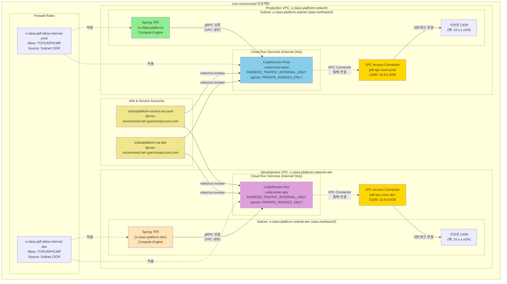
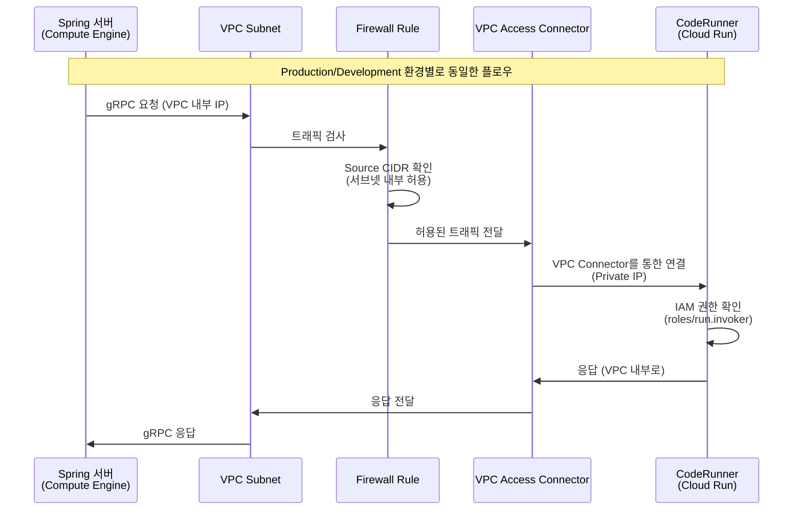
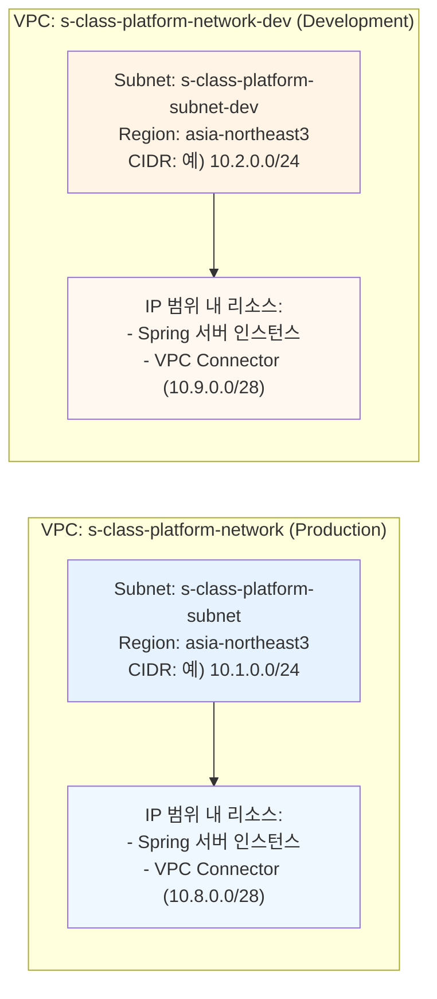

# Infrastructure Architecture

## 현재 구축된 아키텍처



## 네트워크 플로우 상세도



## VPC 및 서브넷 구조



## 주요 특징

### 1. **네트워크 격리**

- Production과 Development 환경이 별도의 VPC로 완전히 분리됨
- 각 VPC는 독립적인 서브넷과 방화벽 규칙 보유

### 2. **VPC Access Connector 역할**

- **CIDR 할당**:
  - Production: `10.8.0.0/28` (16개 IP 주소)
  - Development: `10.9.0.0/28` (16개 IP 주소)
- **목적**: Cloud Run 서비스가 VPC 내부 리소스와 통신하기 위한 브리지
- **트래픽 라우팅**: Cloud Run → VPC Connector → VPC 내부 리소스

### 3. **보안 설정**

- **Ingress**: `INGRESS_TRAFFIC_INTERNAL_ONLY` - VPC 내부에서만 접근 가능
- **Egress**: `PRIVATE_RANGES_ONLY` - 모든 아웃바운드 트래픽이 VPC를 통해 라우팅
- **Firewall**: 서브넷 CIDR 범위 내에서만 통신 허용

### 4. **IAM 권한**

- Spring 서버의 서비스 계정들이 CodeRunner에 `roles/run.invoker` 권한 보유
- 프로젝트 내부이므로 직접 IAM 바인딩 가능

### 5. **통신 경로**

```
Spring 서버 (Compute Engine)
  ↓ (VPC 내부 IP)
서브넷 (s-class-platform-subnet)
  ↓ (방화벽 규칙 확인)
VPC Connector (pdf-vpc-conn-prod)
  ↓ (Private IP)
CodeRunner Cloud Run 서비스
```

## 리소스 요약

| 리소스                 | Production                              | Development                               |
| ---------------------- | --------------------------------------- | ----------------------------------------- |
| **VPC Network**        | s-class-platform-network                | s-class-platform-network-dev              |
| **Subnet**             | s-class-platform-subnet                 | s-class-platform-subnet-dev               |
| **VPC Connector**      | pdf-vpc-conn-prod<br/>CIDR: 10.8.0.0/28 | pdf-vpc-conn-dev<br/>CIDR: 10.9.0.0/28    |
| **CodeRunner Service** | coderunner-prod                         | coderunner-dev                            |
| **Spring 서버**        | s-class-platform<br/>(Compute Engine)   | s-class-platform-dev<br/>(Compute Engine) |
| **Service Account**    | sclassplatform-service-account          | sclassplatform-sa-dev                     |
